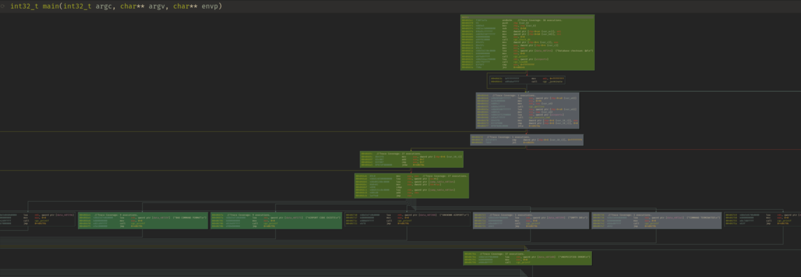

[](https://badge.fury.io/py/pyafl-qemu-trace)

# pyafl_qemu_trace

pip-installable afl-qemu-trace python package

## Installation

```sh
python3 -m pip install pyafl-qemu-trace
```

If you would like to install the trace viewer for binaryninja:

```sh
mkdir -p ~/.binaryninja/plugins/trace_viewer/
cp utilities/trace_viewer.py ~/.binaryninja/plugins/trace_viewer/__init__.py
```

## Building

Note: do *not* try to publish sdist! Only wheels will work since we are distributing
binaries.

If you would like to build this package, clone it and run `poetry build -f wheel`.

You will need to have `poetry`, `docker`, and `docker-compose` or `docker compose` (v2)
installed.

To build multiple versions (if you have multiple python versions installed) just:

```sh
$ deactivate
$ poetry env use 3.8
$ poetry build -f wheel
<...snip...for as many versions as you need...>
$ deactivate
$ poetry env use 3.9
$ poetry build -f wheel
$ poetry publish
```


## Features

This tool is meant to be, for the most part, dependency free and provided as a
binary-only package to be used as a component of other tools. However, there are a few
features beyond what the [inspiration](https://pypi.org/project/shellphish-qemu/) provided.

* Improved trace parsing -- parses more events from the trace and eschews YACC for regex
* Faster throughput -- uses pipes to collect data from afl-qemu-trace instead of going
  through the filesystem for super fast reads
* Has some test cases!

There is also a loader for Binary Ninja [here](utilities/trace_viewer.py) that can load
parsed `TraceResult` outputs that have been serialized to JSON with `TraceResult.export`
and display them as a heatmap on the CFG as shown below:



## Examples

### General Usage

```python
from pyafl_qemu_trace import qemu_path

# Get the path to the tracer binary
tracer = qemu_path("x86_64")

# Run the tracer with the provided wrapper
from pyafl_qemu_trace import TraceRunner
from shutil import which

retcode, stdout, stderr, log = TraceRunner.run(
    "x86_64", 
    which("xxd"), 
    cwd="/tmp", 
    input_data="\x41" * 400, 
    timeout=10
)

# Parse the output of the tracer into a programmatically
# workable data structure result
from pyafl_qemu_trace import TraceParser

result = TraceParser.parse(log)

print(f"The trace has {len(result.addrs)} instructions!")
```

### Export trace for viweing
```python

```python
from pyafl_qemu_trace import TraceRunner, TraceParser
from shutil import which
from pathlib import Path
retcode, stdout, stderr, log = TraceRunner.run(
    "x86_64", 
    which("xxd"), 
    cwd="/tmp", 
    input_data="\x41" * 400, 
    timeout=10
)

result = TraceParser.parse(log)
result.export(Path("/tmp/trace.json"))
```

This trace can then be loaded into binaryninja with
[the provided trace viewer](utils/trace_viewer.py) by picking
`Tools -> Plugins -> Open File (QEMU Format)` and selecting the exported JSON file.

### Embarrasingly Parallel Tracing

```python
from concurrent.futures import as_completed, ThreadPoolExecutor
from pyafl_qemu_trace import TraceRunner, TraceParser
from shutil import which

# .41s to run this...not bad!
with ThreadPoolExecutor() as executor:
    futures = []
    for a in (
        b"\x41",
        b"\x42",
        b"\x43",
        b"\x44",
        b"\x45",
        b"\x46",
        b"\x47",
        b"\x48",
    ):
        futures.append(
            executor.submit(
                TraceRunner.run,
                "x86_64",
                which("xxd"),
                input_data=a * 400,
                ld_library_paths=["/lib64", "/lib"],
                timeout=5,
            )
        )

    for future in as_completed(futures):
        try:
            retcode, stdout, stderr, log = future.result()
            print(f"Completed with: {retcode} and loglength {len(log)}")
            assert len(log) == 8872190
        except Exception as e:
            assert False, "Exception: {}".format(e)
```
### Embarrasingly Parallel Tracing And Parsing


(See `test_parse_multi_parallel_real_x86_64` for an example
that parallelizes the parsing step as well)

## Requirements

Either `docker-compose` or `docker compose` should be available at build time, but when
installing, no dependencies are required, this basically just downloads a bunch of
binaries for you.

## Testing

Tests can be run with `poetry run pytest`, you'll need to run `poetry install` first.

Profiling with memray can be added to tests by running `poetry run pytest --memray`.

## Targets

Supported targets for `afl-qemu-trace` are as follows:

* aarch64
* arm
* i386
* mips
* mips64
* ppc
* ppc64
* riscv32
* riscv64
* x86_64